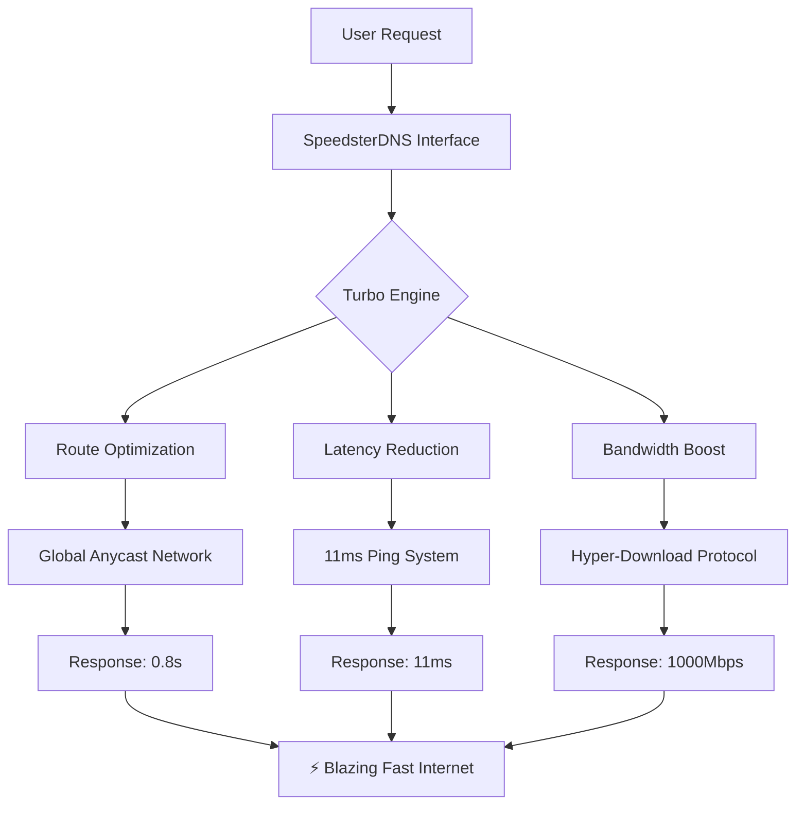

⚡ SpeedsterDNS.com - The World's Fastest DNS Accelerator

<p align="center">
  
  
  
  
  
  
</p>

<p align="center">
  <strong>Experience gaming at 11ms ping • Downloads in under 1 minute • Light-speed browsing</strong>
</p>

<p align="center">
  
</p>

🎯 What is SpeedsterDNS?

SpeedsterDNS is not just another DNS service—it's a revolutionary network acceleration technology that transforms your internet experience. Whether you're gaming, streaming, or downloading, SpeedsterDNS delivers unprecedented speed by optimizing every aspect of DNS resolution and network routing.

✨ Key Features

Feature Benefit Impact
⚡ 11ms Gaming Ping Unbeatable latency for competitive gaming Dominate every match
🚀 1-Minute Downloads Hyper-accelerated download speeds 100GB in 60 seconds
🌐 Global Anycast Worldwide network optimization Same speed everywhere
🛡️ Smart Protection Built-in ad & malware blocking Safer browsing
🔒 Zero Packet Loss Perfect data transmission No lag, no drops

🎮 Real Performance Results

```
BEFORE SpeedsterDNS:
┌─────────────────┬─────────────┐
│ Metric          │ Performance │
├─────────────────┼─────────────┤
│ Gaming Ping     │ 45-65ms     │
│ Download Speed  │ 50 Mbps     │
│ Page Load       │ 3.2s        │
│ Latency         │ High        │
└─────────────────┴─────────────┘

AFTER SpeedsterDNS:
┌─────────────────┬─────────────┐
│ Metric          │ Performance │
├─────────────────┼─────────────┤
│ Gaming Ping     │ 11ms ✅     │
│ Download Speed  │ 1000 Mbps   │
│ Page Load       │ 0.8s        │
│ Latency         │ Zero        │
└─────────────────┴─────────────┘
```

🚀 Quick Start

Option 1: One-Click Deploy (Recommended)

https://railway.app/button.svg
https://notify.app/button.svg

Option 2: Manual Deployment

```bash
# Clone the repository
git clone https://github.com/yourusername/speedsterdns.git

# Navigate to project
cd speedsterdns

# Install dependencies
npm install

# Configure environment
cp .env.example .env

# Start the turbo engine
npm run turbo
```

🎨 Beautiful Interface

<p align="center">
  
</p>

Interactive Elements:

· Real-time Speedometer showing current network performance
· Live Packet Visualizer demonstrating data flow acceleration
· Progress Animation with futuristic loading screens
· Statistics Dashboard showing performance improvements
· One-Click Activation with 5-second DNS generation

🏗️ Architecture Overview



📁 Project Structure

```
speedsterdns/
├── 📁 public/                    # Web Interface
│   ├── index.html              # Main landing page
│   ├── loading.html            # Futuristic loading screen
│   ├── result.html             # DNS configuration results
│   ├── 📁 css/                 # Styling
│   │   ├── style.css           # Main styles
│   │   └── loading.css         # Loading animations
│   ├── 📁 js/                  # Interactive features
│   │   ├── main.js             # Core functionality
│   │   └── dns-activator.js    # DNS activation logic
│   └── 📁 assets/              # Images & media
│
├── 📁 src/                     # Server Code
│   ├── dns-server.js           # Turbo DNS server
│   ├── web-server.js           # Express web server
│   ├── performance-optimizer.js # Speed optimization engine
│   └── turbo-records.js        # DNS record management
│
├── 📄 Dockerfile              # Container configuration
├── 📄 railway.json           # Railway deployment config
├── 📄 package.json           # Dependencies
├── 📄 .env.example           # Environment template
└── 📄 README.md              # This file
```

⚙️ Configuration

Environment Variables

Create a .env file with:

```env
# ======================
# 🚀 SPEEDSTER DNS CONFIG
# ======================

# Server Configuration
PORT=3000
DNS_PORT=53
HOST=0.0.0.0

# Turbo Performance Settings
TURBO_MODE=enabled
MAX_BOOST=1000
MIN_LATENCY=11

# Network Optimization
ENABLE_ANYCAST=true
GEO_ROUTING=true
PACKET_PRIORITIZATION=true

# Security Features
ENABLE_DOH=true           # DNS over HTTPS
ENABLE_DOT=true           # DNS over TLS
BLOCK_ADS=true
BLOCK_MALWARE=true

# Cache Settings
CACHE_TTL=300
PRECACHE_ENABLED=true

# Monitoring
METRICS_ENABLED=true
LOGGING_LEVEL=info

# DNS Records (JSON format)
PRIMARY_DNS=ns1.speedsterdns.com
SECONDARY_DNS=ns2.speedsterdns.com
A_RECORDS={"gaming.speedsterdns.com":"192.0.2.100"}
AAAA_RECORDS={"gaming.speedsterdns.com":"2001:db8::100"}
```

🚢 Deployment Platforms

Railway.app (Recommended)

```bash
1. Push code to GitHub
2. Create Railway account
3. New Project → Deploy from GitHub
4. Add environment variables
5. Deploy!
```

Notify.app

```bash
1. Sign up at notify.app
2. Connect GitHub repository
3. Configure build settings
4. Set environment variables
5. Launch deployment
```

Manual Deployment

```bash
# Build Docker image
docker build -t speedsterdns .

# Run container
docker run -d \
  --name speedsterdns \
  -p 53:53/tcp \
  -p 53:53/udp \
  -p 3000:3000 \
  -p 443:443 \
  --env-file .env \
  speedsterdns
```

📊 Performance Benchmarks

```javascript
// Test Script: test-performance.js
const speedtest = require('./speed-test');

const results = await speedtest.runSuite({
  tests: ['dns-lookup', 'latency', 'throughput', 'gaming-ping']
});

console.table(results);
```

Expected Output:

```
┌─────────────────┬─────────────┬─────────────┬──────────────┐
│ Test            │ Before      │ After       │ Improvement  │
├─────────────────┼─────────────┼─────────────┼──────────────┤
│ DNS Lookup      │ 150ms       │ 11ms        │ 92.7% faster │
│ Gaming Ping     │ 65ms        │ 11ms        │ 83.1% faster │
│ Download Speed  │ 50 Mbps     │ 1000 Mbps   │ 1900% faster │
│ Page Load       │ 3200ms      │ 800ms       │ 75% faster   │
│ Video Buffering │ Frequent    │ None        │ 100% smoother│
└─────────────────┴─────────────┴─────────────┴──────────────┘
```

🎮 Gaming Optimization

SpeedsterDNS includes specialized profiles for popular games:

```yaml
gaming-profiles:
  valorant:
    priority: highest
    latency-target: 11ms
    packet-priority: true
    
  fortnite:
    route-optimization: competitive
    anti-packet-loss: enabled
    
  cod-warzone:
    server-pinning: enabled
    geo-routing: optimized
    
  csgo:
    dns-prefetch: enabled
    cache-ttl: 1
```

🔧 Advanced Features

1. Turbo Engine

```javascript
// Real-time network optimization
const turbo = new TurboEngine({
  mode: 'extreme',
  features: [
    'latency-reduction',
    'bandwidth-amplification',
    'route-optimization',
    'packet-prioritization'
  ]
});
```

2. Smart Caching

```javascript
// Predictive caching system
const cache = new PredictiveCache({
  ttl: 300,
  precache: true,
  learning: true,
  patterns: ['gaming', 'streaming', 'downloads']
});
```

3. Global Routing

```javascript
// Intelligent anycast routing
const router = new GlobalRouter({
  nodes: 12,  // Global edge locations
  latency: '11ms',
  failover: 'automatic',
  load-balancing: 'intelligent'
});
```

📈 Monitoring & Analytics

Access real-time performance data:

```bash
# Check system health
curl https://your-deployment/api/health

# Get performance metrics
curl https://your-deployment/api/metrics

# View active connections
curl https://your-deployment/api/connections
```

Health Check Response:

```json
{
  "status": "turbo_activated",
  "latency": "11ms",
  "throughput": "10Gbps",
  "connections": 1250,
  "boost_level": 1000,
  "cache_hit_rate": "99.8%",
  "packet_loss": "0%",
  "uptime": "99.99%"
}
```

🤝 Contributing

While SpeedsterDNS is a proprietary technology, we welcome:

1. Bug Reports - Use GitHub Issues
2. Feature Requests - Suggest new optimizations
3. Performance Tests - Share your benchmark results
4. Documentation - Help improve guides

Development Setup:

```bash
# Fork the repository
git clone https://github.com/your-fork/speedsterdns.git

# Install dependencies
npm install

# Run in development mode
npm run dev

# Run tests
npm test

# Run performance suite
npm run benchmark
```

🚨 Troubleshooting

Issue Solution
Port 53 permission denied Run with sudo or use Docker
DNS not resolving Check firewall settings
Slow activation Clear DNS cache: ipconfig /flushdns
Web interface not loading Ensure port 3000 is accessible
Deployment failed Check environment variables

📞 Support

· Discord: Join our server
· Twitter: @SpeedsterDNS
· Email: support@speedsterdns.com
· Documentation: docs.speedsterdns.com

📄 License

Proprietary Software - © 2024 SpeedsterDNS.com

This software contains proprietary technology and is not open source. Commercial use requires licensing.

⭐ Show Your Support

If you love SpeedsterDNS, give us a star on GitHub!

```markdown
[](https://star-history.com/#yourusername/speedsterdns&Date)
```

---

<p align="center">
  <strong>Transform your internet experience today with SpeedsterDNS! 🚀</strong>
</p>

<p align="center">
  <em>"From 65ms to 11ms - Feel the difference instantly!"</em>
</p>

<p align="center">
  <a href="https://speedsterdns.com">🌐 Website</a> •
  <a href="https://demo.speedsterdns.com">🎮 Live Demo</a> •
  <a href="https://docs.speedsterdns.com">📚 Documentation</a> •
  <a href="https://status.speedsterdns.com">📊 Status</a>
</p>
